# POLARITY — Диаграмма боевого флоу

Карта взаимосвязей боевых механик. Категории сверху (Урон / Контроль / Движение / Вспомогательные действия), электризация в центре как gateway, заряд игрока как ресурс.

Редактировать можно прямо в этом файле — рендеры (Obsidian, VSCode + Mermaid Preview, GitHub, mermaid.live) подхватят изменения.

```mermaid
flowchart TB
    %% =========================================
    %%   КАТЕГОРИИ (заголовки)
    %% =========================================
    URON{{"Урон"}}:::urontitle
    CONTROL{{"Контроль"}}:::ctrltitle
    MOVE{{"Движение"}}:::movetitle
    AUX_LABEL{{"Вспомогательные<br/>действия"}}:::auxtitle

    %% =========================================
    %%   УЗЛЫ — УРОН
    %% =========================================
    Melee["Ближний бой"]:::uron
    Charger["Выстрел зарядомёта"]:::uron
    Throw["Бросок пропа<br/>или другого NPC"]:::uron
    Wallslam["Wallslam<br/>(удар об стену)"]:::uron
    DropKick["Drop Kick"]:::uron

    URON --> Melee
    URON --> Charger
    URON --> Throw
    URON --> Wallslam
    URON --> DropKick

    %% =========================================
    %%   УЗЛЫ — КОНТРОЛЬ
    %% =========================================
    Capture["Захват самого NPC"]:::ctrl
    Stun["Оглушение от удара<br/>пропом или NPC"]:::ctrl
    Knockback["Knockback<br/>(отбрасывание ближним боем)"]:::ctrl

    CONTROL --> Capture
    CONTROL --> Stun
    CONTROL --> Knockback

    %% =========================================
    %%   УЗЛЫ — ДВИЖЕНИЕ
    %% =========================================
    Walk["Просто ходьба"]:::move
    Jump["Прыжок,<br/>двойной прыжок"]:::move
    Slide["Слайд"]:::move
    Wallrun["Бег по стене"]:::move
    AirDash["Воздушный рывок"]:::move
    ChargeBoost["Charge Boost<br/>(rocket boost)"]:::move

    MOVE --> Walk
    MOVE --> Jump
    MOVE --> Slide
    MOVE --> Wallrun
    MOVE --> AirDash
    MOVE --> ChargeBoost

    %% =========================================
    %%   УЗЛЫ — ВСПОМОГАТЕЛЬНЫЕ ДЕЙСТВИЯ
    %% =========================================
    Pistol["Выстрел из<br/>волнового пистолета"]:::aux
    Channel["Канализация<br/>(press-press)"]:::aux
    Electrify(("Электризация цели<br/>(− заряд)")):::electrify

    AUX_LABEL --> Pistol
    AUX_LABEL --> Channel
    AUX_LABEL --> Electrify

    %% =========================================
    %%   УЗЕЛ — РЕСУРС ИГРОКА
    %% =========================================
    PlayerCharge[/"Заряд игрока (+)<br/>патроны зарядомёта<br/>+ топливо charge boost"/]:::resource

    %% =========================================
    %%   СВЯЗИ — Источники электризации
    %% =========================================
    Pistol -->|"накладывает (−)"| Electrify
    Melee -->|"удар сообщает (−) цели"| Electrify

    %% =========================================
    %%   СВЯЗИ — Электризация → последствия
    %% =========================================
    Electrify -->|"снаряд наводится"| Charger
    Electrify --> Channel

    %% =========================================
    %%   СВЯЗИ — Канал → захват / запуск
    %% =========================================
    Channel -->|"1-е нажатие"| Capture
    Channel -->|"2-е нажатие<br/>(реверс-запуск)"| Throw

    %% =========================================
    %%   СВЯЗИ — Бросок → итоговый урон / контроль
    %% =========================================
    Throw -.->|"удар об стену"| Wallslam
    Throw -.->|"импакт NPC↔NPC"| Stun

    %% =========================================
    %%   СВЯЗИ — Drop Kick / Knockback
    %% =========================================
    Jump -->|"в воздухе → дайв"| DropKick
    Melee -->|"BaseDist + скорость"| Knockback

    %% =========================================
    %%   СВЯЗИ — Заряд игрока (ресурс)
    %% =========================================
    Melee -->|"+2.0 за удар"| PlayerCharge
    PlayerCharge -->|"1 патрон"| Charger
    PlayerCharge -->|"отдача под ноги"| ChargeBoost

    %% =========================================
    %%   СВЯЗИ — Movement → Damage (Momentum bonus)
    %% =========================================
    MOVE -.->|"Momentum bonus<br/>скорость → +урон"| Melee

    %% =========================================
    %%   СТИЛИ
    %% =========================================
    classDef urontitle fill:#ffdddd,stroke:#cc0000,stroke-width:3px,color:#cc0000
    classDef ctrltitle fill:#fdd9fd,stroke:#aa00aa,stroke-width:3px,color:#aa00aa
    classDef movetitle fill:#ddffdd,stroke:#009900,stroke-width:3px,color:#009900
    classDef auxtitle fill:#eeeeee,stroke:#444444,stroke-width:3px,color:#000000
    classDef uron fill:#ffeeee,stroke:#cc0000,color:#cc0000
    classDef ctrl fill:#fde0fd,stroke:#aa00aa,color:#aa00aa
    classDef move fill:#e0ffe0,stroke:#009900,color:#009900
    classDef aux fill:#f0f0f0,stroke:#444444,color:#000000
    classDef electrify fill:#ffe066,stroke:#bb8800,stroke-width:2px,color:#000000
    classDef resource fill:#ffeebb,stroke:#cc8800,stroke-width:2px,color:#000000
```



---

## Легенда

| Цвет | Категория |
|------|-----------|
| 🔴 Красный | Урон |
| 🟣 Фиолетовый | Контроль |
| 🟢 Зелёный | Движение |
| ⚪ Серый | Вспомогательные действия (не наносят прямого урона/контроля) |
| 🟡 Жёлтый круг | Электризация (центральный gateway-узел) |
| 🟠 Оранжевый параллелограмм | Заряд игрока (ресурс) |

## Типы стрелок

- **Сплошная →** — прямая причинно-следственная связь (нажал кнопку → произошло событие)
- **Пунктирная -.->** — производная связь / модификатор (бросок может закончиться wallslam'ом, движение даёт бонус к урону)

## Как редактировать

- **Добавить узел:** `MyNode["Текст"]:::class` — где class это `uron` / `ctrl` / `move` / `aux`
- **Добавить связь:** `A -->|"подпись"| B` (сплошная) или `A -.->|"подпись"| B` (пунктир)
- **Поменять форму:** `[" "]` обычный прямоугольник, `((" "))` круг, `{" "}` ромб, `{{ }}` шестиугольник, `[/ /]` параллелограмм

## Открыть в редакторе

- **mermaid.live** — копировать блок между ` ```mermaid ` и ` ``` `
- **Obsidian** — рендерится автоматически в preview
- **VSCode** — установить расширение «Markdown Preview Mermaid Support»
